<p align="center">
  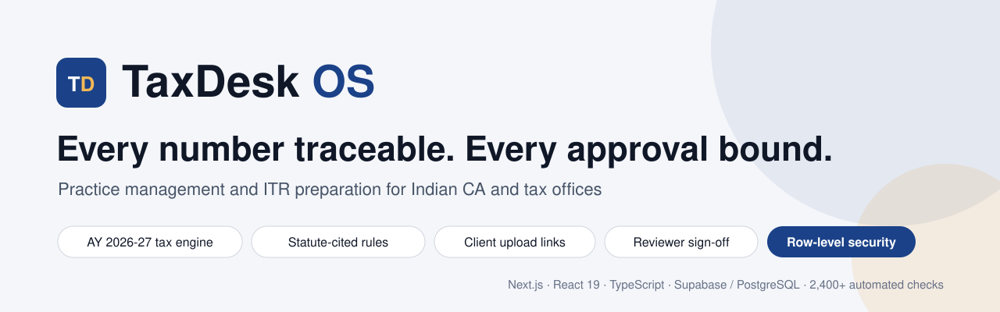
</p>

<p align="center">
  <a href="https://github.com/wig1-max/taxdesk-os/actions/workflows/ci.yml"></a>
  <a href="LICENSE"></a>
  
  
  
</p>

# TaxDesk OS

**An open-source operations command center for Indian CA (Chartered Accountant)
and tax practices.** It runs the whole office workflow (clients, cases, document
collection, physical document custody, fees, PDFs and WhatsApp follow-ups), and
its **Tax Desk** is an ITR-preparation workspace built on a pure, deterministic,
versioned **AY 2026-27 income tax engine** in which every material figure traces
back to a ledger entry, a rule and a cited statutory source.

It's a **staff tool, not a self-filing app.** Clients never log in. They send
documents through expiring upload links. The system never logs into a
government portal and never files anything: a qualified person does that after
review.

Designed and built end to end by **[Aryan Madaan](https://github.com/wig1-max)**.

> **Status:** the office-core workflow and the Tax Desk control pipeline are
> substantially implemented. Tax computation coverage is deliberately bounded,
> and unsupported situations are blocked, never guessed. Every shipped tax pack
> is marked `draft`, and the codebase refuses real-client reliance until a CA
> has verified the pack against official sources. Run it with synthetic data.

---

## Contents

- [Why it exists](#why-it-exists)
- [Screenshots](#screenshots)
- [Features](#features)
- [Tax engine and rule provenance](#tax-engine-and-rule-provenance)
- [Security model](#security-model)
- [Architecture](#architecture)
- [Quality and testing](#quality-and-testing)
- [Getting started](#getting-started)
- [Project layout](#project-layout)
- [License](#license)

## Why it exists

Small Indian tax offices run on WhatsApp, spreadsheets and paper files. Documents
arrive in pieces, computations live in Excel, nobody can say which number came
from which Form 16, and "filed" gets confused with "ready". TaxDesk OS turns
that into a controlled pipeline with one rule at its core:

> *Every source evidenced, every material number traceable, every exception
> reviewed, every approval bound to the exact computation, and every filing
> outcome reconciled back into the case.*

## Screenshots

| Dashboard | Tax Desk |
| --- | --- |
| 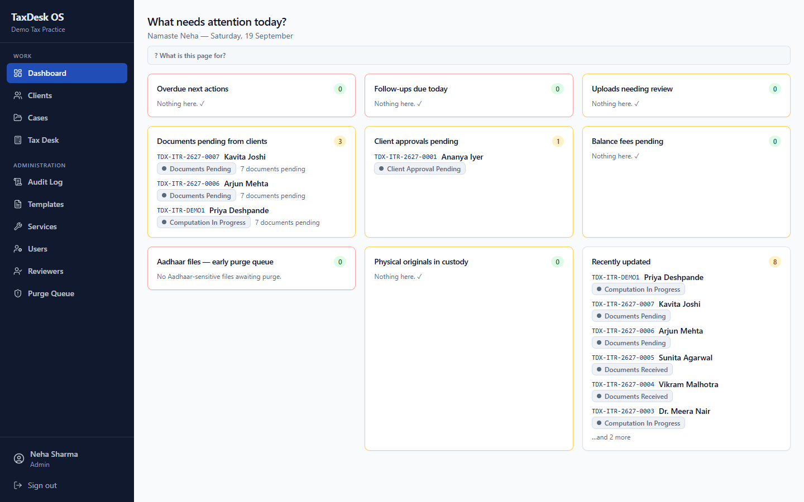 | 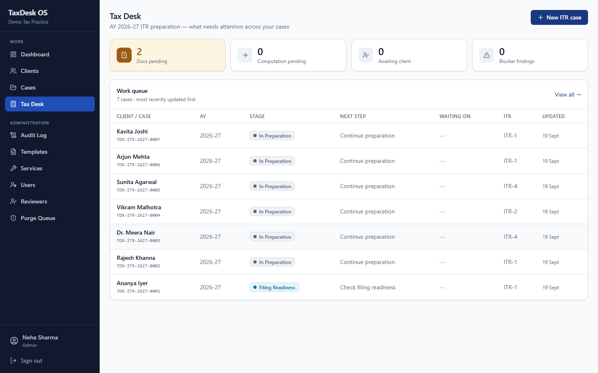 |

| Tax case workbench | Computation |
| --- | --- |
| 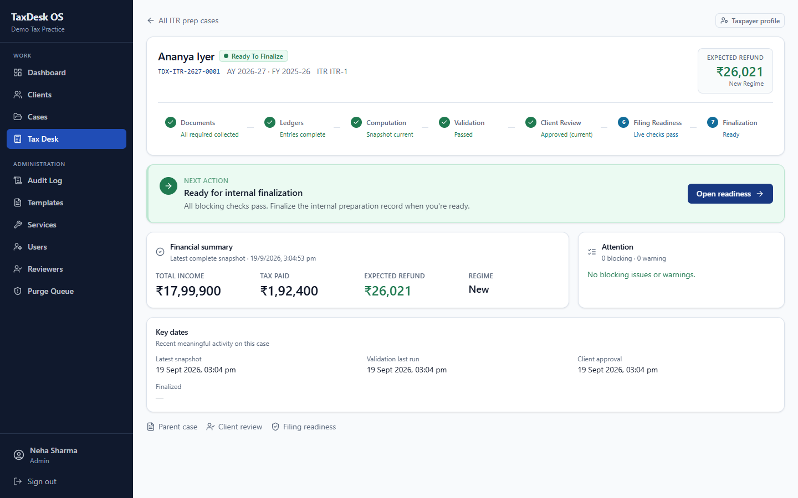 | 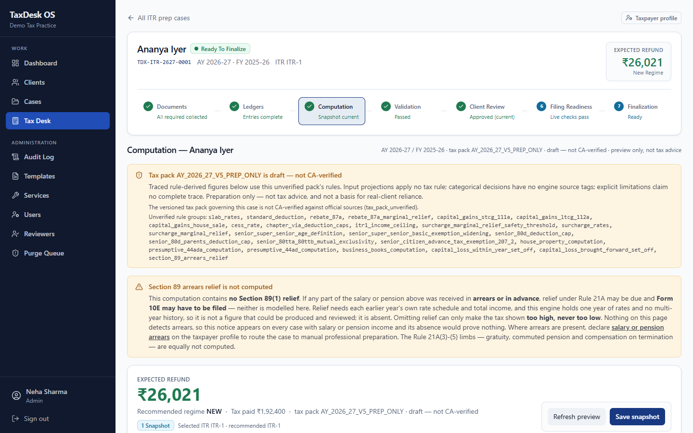 |

| Ledgers | Validation inbox |
| --- | --- |
| 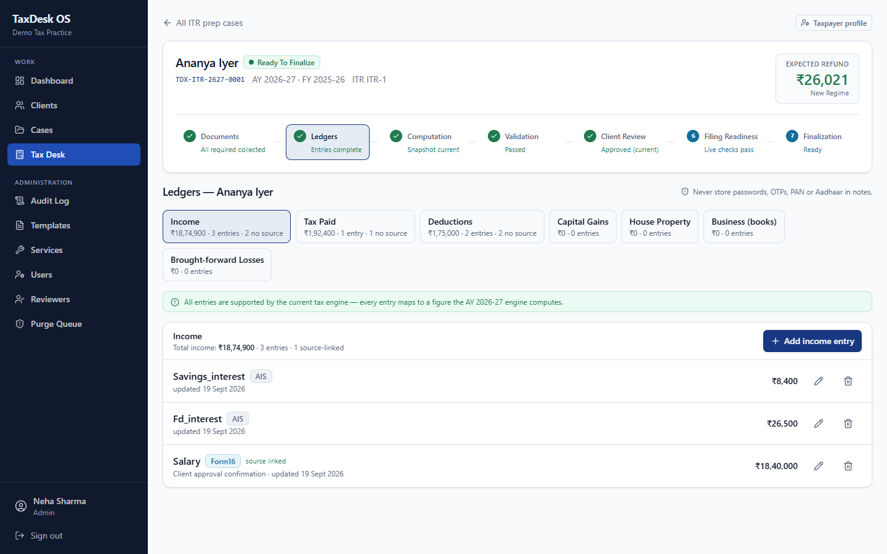 | 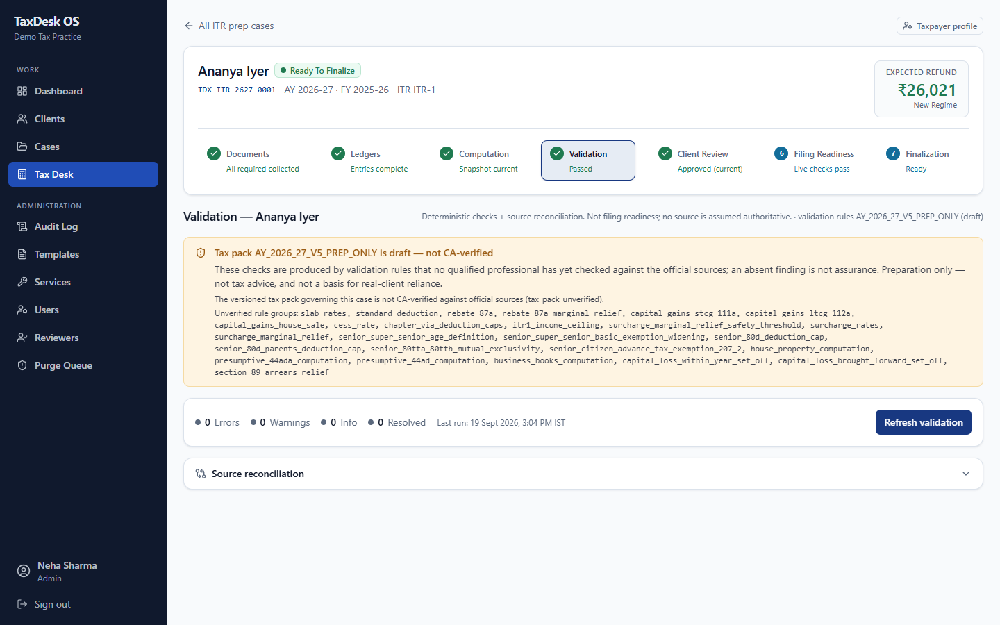 |

| Filing readiness | Client review pack |
| --- | --- |
| 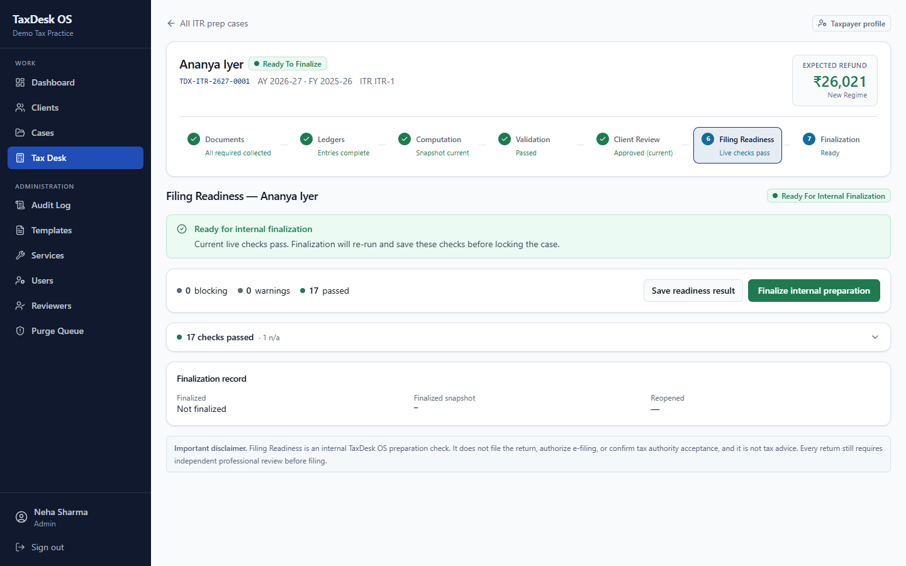 | 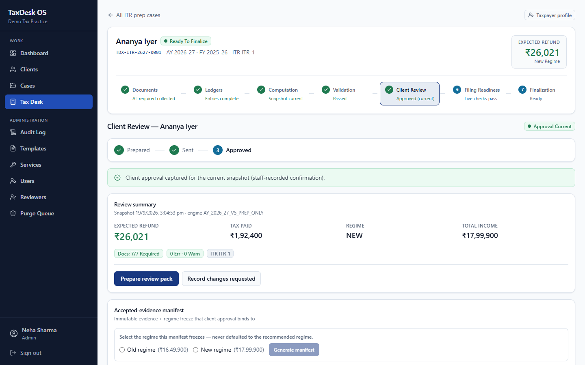 |

| Case documents checklist | Clients (PAN masked) |
| --- | --- |
| 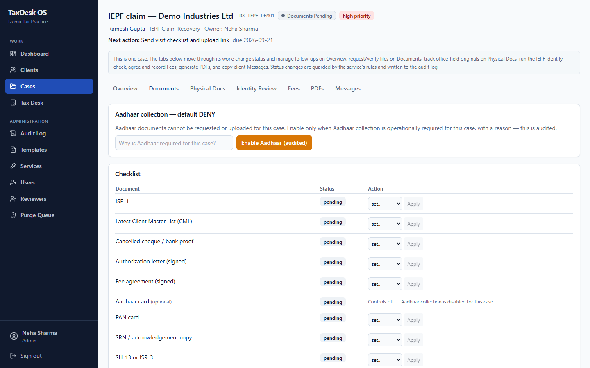 | 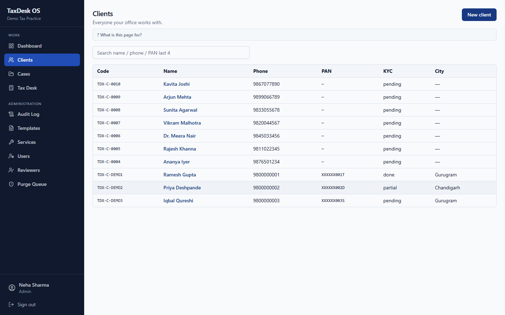 |

<details>
<summary>More screens</summary>

| Case fees | Generated PDFs |
| --- | --- |
| 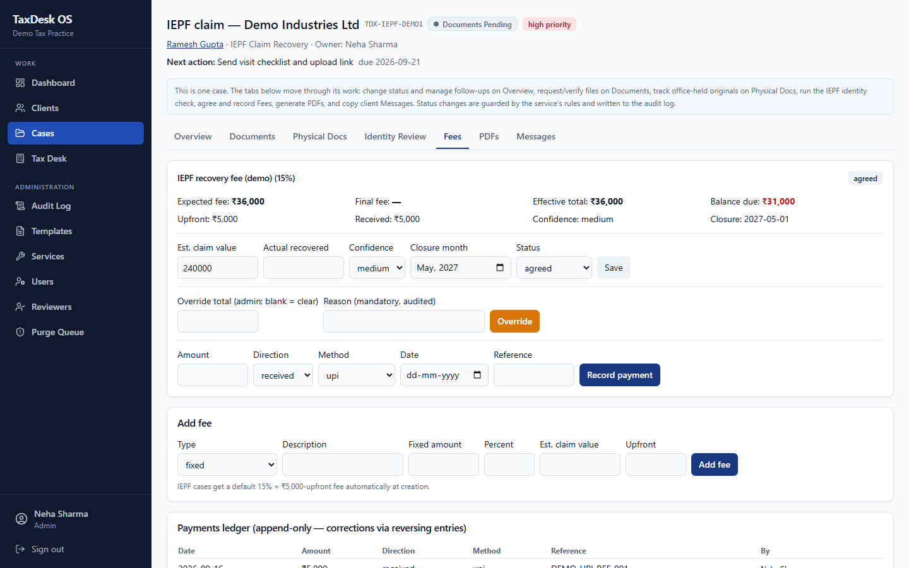 | 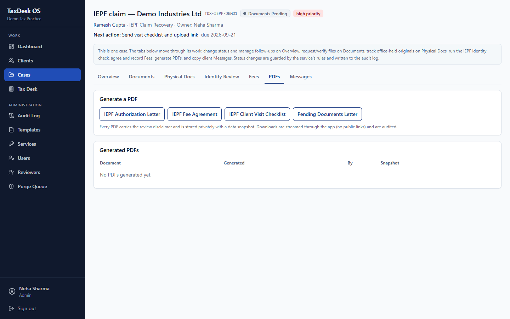 |

| WhatsApp message templates | Audit log |
| --- | --- |
| 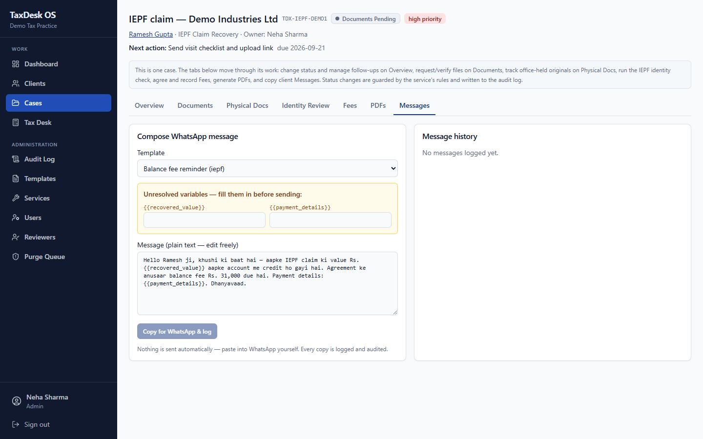 | 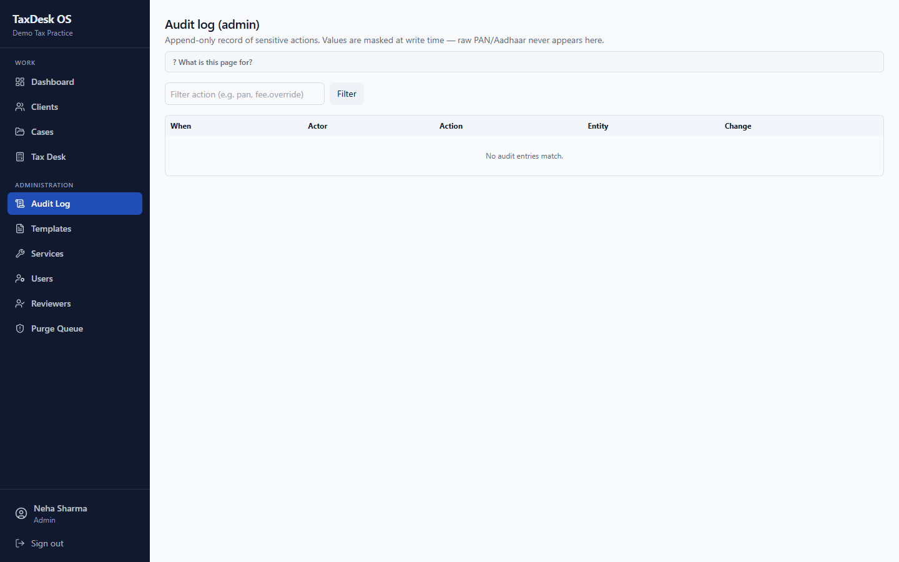 |

| Qualified-reviewer sign-off | Mobile |
| --- | --- |
| 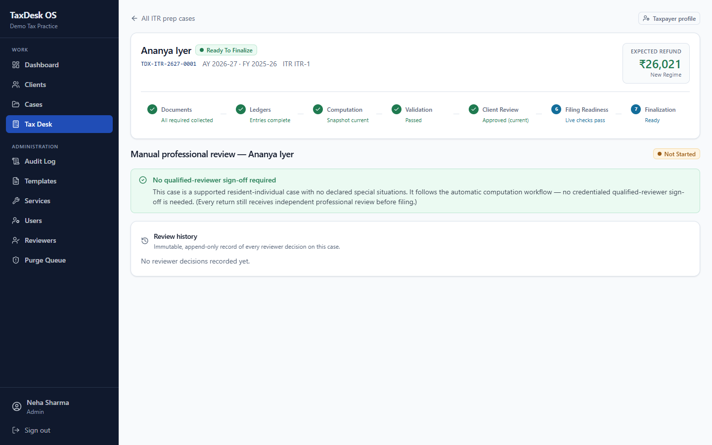 | 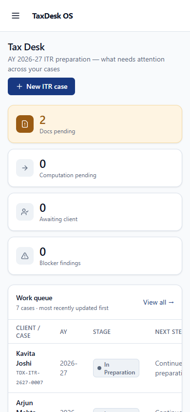 |

</details>

All screenshots use synthetic data from the local seed and test fixtures.

## Features

### Office core
- **Clients** with invite-only staff access. PAN is encrypted with AES-256-GCM,
  masked everywhere (`XXXXXX999Z`), and can only be revealed by an admin with a
  stated reason. Every reveal is audited. There is no Aadhaar number column at
  all.
- **Cases** for ITR, IEPF share-recovery claims, GST, registrations and
  MF/insurance/loan leads. Each service has its own **status machine** with
  server-enforced transition guards (for example, an IEPF case can't reach
  IEPF-5 preparation before identity review, agreements and the upfront fee).
- **Document checklists** auto-populated per service: request, receive, verify,
  reject (a reason is required), or waive (a reason is required). Aadhaar
  documents are default-deny behind an audited case flag, with an **early-purge
  queue**.
- **Expiring client upload links**: consent capture, PDF/JPG only,
  **magic-byte MIME checks** (a renamed `.exe` is rejected), size caps,
  content-addressed **duplicate-upload protection**, quota-race-safe counters,
  a review queue, and revocation.
- **Physical document custody** tracking for original papers: received,
  returned or dispatched (courier, tracking number and date).
- **Fees and payments**: percentage-plus-minimum fee rules, upfront payments,
  recovered-amount reconciliation, and admin-only overrides that need a reason.
- **PDF generation** (`@react-pdf/renderer`): ITR computation summary
  (watermarked DRAFT), client approval sheet, IEPF visit checklist,
  authorization letter, fee agreement and pending-documents letter. All of them
  pull live case data and none hardcode amounts. Downloads use 300-second signed
  URLs.
- **WhatsApp follow-up templates** in Hinglish with variable pre-fill.
  Unresolved variables block copying. Templates are versioned, and nothing is
  ever sent automatically.
- **Dashboard queues**: pending documents, the review queue, follow-ups due,
  overdue cases, dispatch and objection queues, balance fees, custody and
  purges.
- **Append-only audit log** of every sensitive action, with PII-safe metadata.
- **Admin settings**: users and roles, services, and PDF/message templates with
  preview.

### Tax Desk (ITR preparation)
- **Case workbench** with a readiness rail and a single derived *next action*
  for each case.
- **Ledgers** for salary, interest, dividends, house property (let-out and
  self-occupied), presumptive business income (**44AD / 44ADA**), business
  books (including **F&O / intraday** classification), **section 32
  depreciation**, capital gains (**111A / 112A / 112**, house sale with **CII
  indexation**), brought-forward losses, deductions (**80C / 80CCD / 80D /
  80G / 80TTA / 80TTB …**) and taxes paid (TDS, TCS, advance, self-assessment),
  each with source-document association.
- **Deterministic computation** under both the **new regime (115BAC)** and the
  old regime, with the section 87A rebate, surcharge with **marginal relief**,
  4% health and education cess, and **senior / super-senior** treatment.
  Results are stored as **immutable snapshots** bound to a rules version.
- **Validation inbox**: engine and runner findings with severity, a suggested
  action, a resolve or dismiss lifecycle, and a visible "validation run"
  marker, so a zero-finding run is distinguishable from never having run.
- **Eligibility gate**: situations the engine doesn't support (such as loss
  set-off or unsupported gain types) route the case to **manual professional
  preparation** instead of producing a wrong number.
- **Qualified-reviewer sign-off** is a credentialed workflow, and it isn't an
  eligibility override.
- **Client review pack**: a staff-recorded client confirmation bound to the
  exact snapshot it confirms.
- **Filing readiness and internal finalization**: a gated checklist.
  Finalization is not filing and is not tax-authority acceptance, and the UI
  never uses one's language for the other. Finalized cases are read-only, with
  an admin-only reopen.
- **Evidence manifest and source proposals**: a propose, review and promote
  workflow for facts extracted from documents. Automation may only *propose*,
  never decide.
- **Case traceability**: every computed figure maps back through rule, ledger
  row and source document.

## Tax engine and rule provenance

The engine (`src/lib/tax-engine/ay-2026-27`) and the versioned **tax packs**
(`src/lib/tax-pack`) are pure TypeScript with no framework, database or
environment imports, and a boundary test enforces that.

- **Versioned packs, not globals.** Tax law, source formats and output schemas
  are packaged by assessment year and statutory world (AY 2026-27 under the
  Income-tax Act, 1961, plus a TY 2026-27 / Income-tax Act, 2025 stub). A
  computation is reproducible from an immutable pack identity.
- **Statute-cited rules.** Every rule carries official-source provenance. The
  repository commits page-range **text extracts of the Finance Act 2026, the
  Income-tax Act and Rules, and CBDT cost-inflation-index notifications**
  (`docs/evidence/statutory-sources`), each tied to a SHA-256 of the source PDF.
- **Quotes are verified.** A caveat shown to a preparer may only quote statute
  that actually appears in a committed extract. The pack refuses to construct
  otherwise, and a test checks every quotation against the extracted text.
- **Honest verification state.** Packs are `draft` until CA-verified, and the
  **reliance blocker** refuses real-client computation against an unverified
  pack.
- **Synthetic case laboratory** (`src/lib/tax-lab`): golden fixtures with
  expected material outputs, a deterministic harness, and executable
  **coverage reports** whose published counts are checked against the live
  vocabularies in CI ([`docs/coverage`](docs/coverage)).

## Security model

- **PostgreSQL row-level security** on every table. Protected writes go only
  through guarded `SECURITY DEFINER` RPCs owned by a least-privilege
  `app_writer` role with a pinned `search_path`. Default privileges are revoked
  and TRUNCATE and trigger over-grants are swept.
- **Server actions re-verify everything**: auth, the active profile, and
  finalized and eligibility state. They never trust a client-sent status or
  count.
- **Hostile-client test suites** hit PostgREST directly as a malicious
  authenticated user: direct table writes, cross-case access, replayed tokens,
  quota races, finalized-case mutation and transaction atomicity.
- **Distributed rate limiting** (Upstash Redis) on the public upload route and
  on signed-URL issuance.
- **PII discipline**: PAN, Aadhaar, OTPs, portal passwords and DSC material are
  never written to notes, audit metadata or telemetry. The validation engine
  even flags credential-like text typed into notes.
- **Local-only database guard**: every destructive database script refuses to
  run while a remote project is linked.
- **Resilience**: route-level error boundaries with PII-safe telemetry, and a
  post-mutation **reconciliation primitive** so a successful action can never
  leave the screen contradicting the database.
- See [`docs/security-review.md`](docs/security-review.md) and
  [`docs/backup-restore.md`](docs/backup-restore.md).

## Architecture

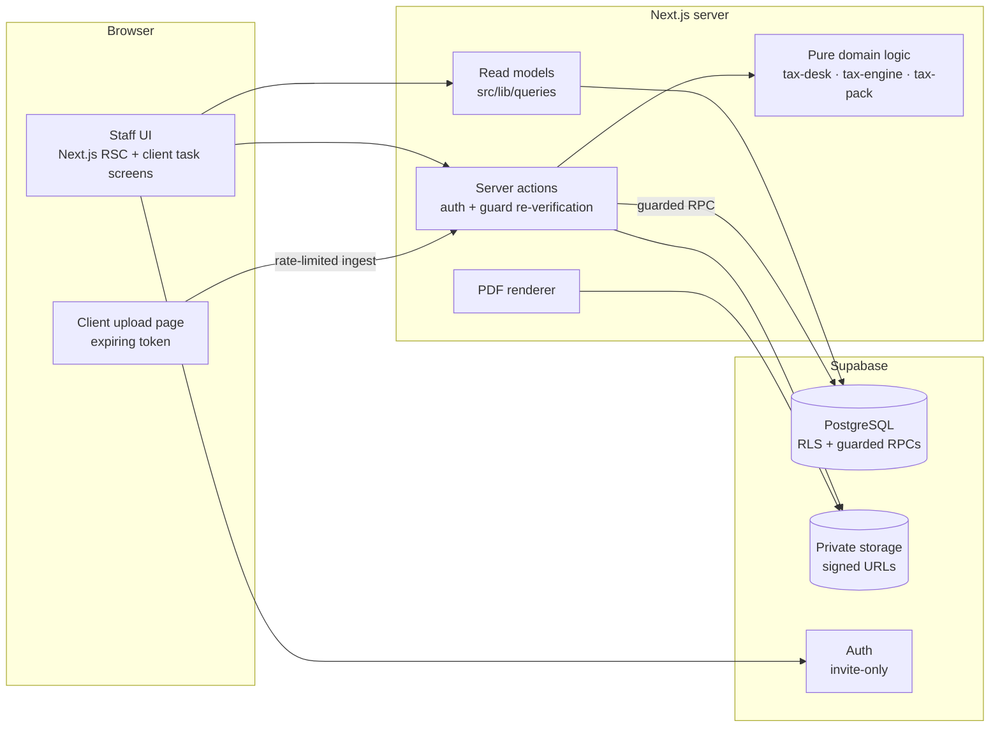
```mermaid
flowchart LR
  subgraph Browser
    UI[Staff UI<br/>Next.js RSC + client task screens]
    UP[Client upload page<br/>expiring token]
  end
  subgraph Server[Next.js server]
    SA[Server actions<br/>auth + guard re-verification]
    RM[Read models<br/>src/lib/queries]
    DOM[Pure domain logic<br/>tax-desk · tax-engine · tax-pack]
    PDF[PDF renderer]
  end
  subgraph Supabase
    PG[(PostgreSQL<br/>RLS + guarded RPCs)]
    ST[(Private storage<br/>signed URLs)]
    AU[Auth<br/>invite-only]
  end
  UI --> SA --> DOM
  UI --> RM --> PG
  SA -->|guarded RPC| PG
  UP -->|rate-limited ingest| SA
  SA --> ST
  PDF --> ST
  UI --> AU
```

The settled product, safety and architecture rules are in
[`PROJECT_CONSTITUTION.md`](PROJECT_CONSTITUTION.md). Engineering conventions
are in [`CONTRIBUTING.md`](CONTRIBUTING.md).

## Quality and testing

| Suite | What it covers | Result |
| --- | --- | --- |
| Unit (Vitest) | Tax engine, packs, provenance, validation, workflow, fees, PDF render, reconciliation core | **1,861 passing** |
| Database catalog (`test:db`) | RLS enabled, protected-column revokes, RPC signatures, `search_path` pinning, trigger coverage | **109 passing** |
| Security suites (`test:security`) | 11 hostile-PostgREST suites: authz boundary, transaction atomicity, eligibility gate, reviewer sign-off, ingestion gates, storage orphans… | **312 passing** |
| Guarded-RPC smoke (`test:rpc-smoke`) | End-to-end RPC calls through PostgREST | **7 passing** |
| End-to-end (Playwright) | Smoke suite across auth, clients, PAN, cases, checklists and every Tax Desk stage, desktop and mobile | **138 passing** (1 skipped) |
| Integrity guards | Statutory-extract hashes, verbatim-quote census, invisible control bytes | CI |

CI runs typecheck, lint, the unit suite, the integrity guards and a production
build on every push. A separate workflow starts a clean local Supabase stack,
applies all 52 migrations from zero, and runs the database, security and E2E
suites.

## Getting started

**Prerequisites:** Node 22, Docker (for local Supabase) and the Supabase CLI
(`npx supabase`).

```bash
git clone https://github.com/wig1-max/taxdesk-os.git
cd taxdesk-os
npm ci

# Start local Supabase: applies every migration and the synthetic seed
npx supabase start

# Configure the app (use the URL and keys printed by `supabase status`)
cp .env.example .env.local
node -e "console.log(require('crypto').randomBytes(32).toString('base64'))"  # PAN_ENCRYPTION_KEY

# Create local admin + staff users (admin@e2e.test / e2e-password)
npm run test:e2e:bootstrap

npm run dev   # http://localhost:3000
```

For a hosted deployment, create a Supabase project (the Mumbai `ap-south-1`
region suits Indian data residency), apply `supabase/migrations`, bootstrap the
first admin with `supabase/bootstrap-admin.sql`, set the Upstash Redis
variables, and never run `seed.sql` against it. Every variable is documented in
[`.env.example`](.env.example).

## Project layout

```
src/
  app/
    (auth)/login/            sign-in
    (app)/                   authenticated shell
      dashboard/ clients/ cases/ audit-log/ settings/
      tax-desk/cases/[id]/   ledgers · computation · validation · review ·
                             readiness · manual-review · profile · documents
    upload/[token]/          public client upload page
    actions/                 server actions (auth + guard re-verification)
  components/                UI, tax-desk task screens, shared primitives
  lib/
    tax-engine/ay-2026-27/   deterministic AY 2026-27 engine
    tax-pack/                versioned packs, provenance, verification state
    tax-desk/                workflow, readiness, eligibility, traceability
    tax-lab/                 synthetic case laboratory (tests only)
    queries/                 read models
    crypto/ pdf/ messages/ telemetry/ validation/
supabase/
  migrations/                52 migrations: schema, RLS, guarded RPCs
  tests/                     SQL smoke tests
tests/                       database catalog, security and RPC suites
e2e/                         Playwright specs
docs/                        security review, backup/restore, coverage reports,
                             statutory evidence extracts
```

## Disclaimer

TaxDesk OS is preparation software. It doesn't provide tax advice and doesn't
file returns. Its tax packs aren't CA-verified, so don't rely on its output for
a real return without independent professional review.

## License

Licensed under the [Apache License 2.0](LICENSE). See [`NOTICE`](NOTICE).

Copyright 2026 Aryan Madaan.
